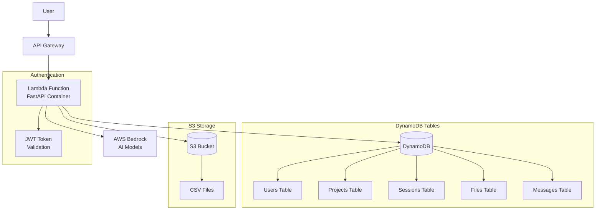

# AWS Infrastructure Architecture

## Development Environment

## Services Overview

- **API Gateway**: REST API endpoint, handles CORS, request routing
- **Lambda**: Containerized FastAPI application, serverless compute
- **DynamoDB**: NoSQL database for all application data
- **S3**: File storage for CSV uploads
- **Bedrock**: AI/ML models for data science conversations

## Environment Configuration

- **DynamoDB Tables**: `dev_` prefix for all table names
- **S3 Bucket**: `leonidas-dev-bucket`
- **API Gateway Stage**: `dev`